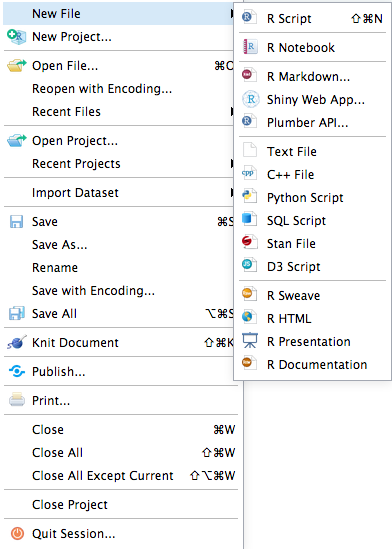
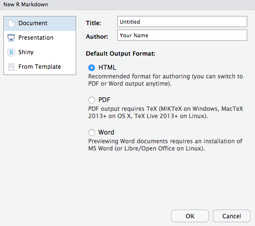
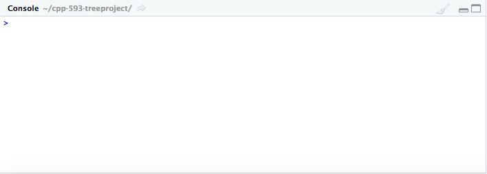

```{r setup, include=FALSE}
knitr::opts_chunk$set(echo = TRUE)
```

<center> 
  <h1 id = "Introduction">Introduction</h1>
</center>

  <p> As the previous quote by biologist Colin Tudge espouses, trees play an essential role in the daily lives of humans, animals, and plants. Recent research on the widespread benefits of trees in a myriad of areas from environmental to physical to socioeconomic well-being has led policymakers to become advocates for eliminating “concrete jungles” in their cities and expanding tree canopy coverage through the planting of urban forests and other green spaces (“Benefits of trees”, 2019; Endreny, 2018; Kabisch et al., 2017).</p>
  
  <p> Early studies on these initiatives by environmental experts have found that urban forests reduce carbon emissions and mitigate global warming (Johnson et al., 2013; Malmsheimer et al., 2011; McPherson & Simpson, 1999; Russo et al., 2015; Zhao et al., 2010; Zheng et al., 2013). For example, a 2011 study conducted by the U.S. Forest Service iterated that reducing greenhouse gases in the environment requires the creation of new forests (Malmsheimer et al., 2011), while an earlier study by McPherson & Simpson (1999) specifically focused on providing a guide for conservationists and business/industry executives to increase tree canopy coverage in communities and offset carbon dioxide emissions. Other studies such as those conducted by Johnson et al. (2013) and Russo et al. (2015) suggested urban forests as a way to reduce the effects of transportation on climate change and research by Zhao et al. (2010) and Zheng et al. (2013) provided overarching summaries of the benefits of urban forests. </p>

   <p> Similarly, investigations performed by socioeconomic and public health researchers have simultaneously espoused that trees and urban green spaces have a positive correlation with health and well-being in human living environments (Daams & Veneri, 2016; Dadvand et al., 2014; Dadvand et al., 2018; De Vries et al., 2007; Donovan, 2017; Faber Taylor & Kuo, 2011; King et al., 2015; Reid et al., 2017; Taylor et al., 1998; Turner‐Skoff & Cavender, 2019; U.S. Department of Agriculture, Forest Service, 2018; Ulmer et al., 2016). Studies by Dadvand et al (2014), Dadvand et al. (2018), Faber Taylor & Kuo (2011), Kabisch et al. (2017), Reid et al. (2017), the U.S. Department of Agriculture, Forest Service (2018), and Ulmer et al. (2016) all found that urban green spaces have significant benefits on the physical and mental health and well-being of individuals, particularly those who suffer from chronic illnesses and developmental difficulties such as obesity, asthma, allergies, diabetes, and ADHD. Other research by De Vries et al. (2007) and King et al. (2015) explore urban forests as outlets for safe play in inner-city areas while Turner et al. (2019) highlighted that trees are important for creating sustainable living environments. </p>
  
  <p> Following these scientific findings, cities have begun the task of creating databases to identify where trees are currently located in their communities and identify where new urban forests are needed (Poon, 2018).  However, the financial and human capital required to create these databases, known as tree censuses, are substantial (Poon, 2018).</p>
  
  <p> The city-wide TreesCount! census that was conducted in New York City, required 12,000 volunteer hours from 2,200 citizen mappers who were trained to utilize “high tech mapping tools with survey wheels, tape measures, and tree identification keys” according to a method developed by a non-profit organization, TreeKIT (“TreesCount!”, 2017). This volunteer work saved the city over $100,000 in survey costs, however even with such a large amount of volunteer hours, it took almost a year and a half to complete the census (“TreesCount!”, 2017). Although this was an intuitive way to save money and help “citizen mappers” and “citizen scientists” discover the importance of trees, many organizations do not have access to such a large pool of volunteers and/or are unable to wait years for results (Butt et al., 2013; Poon, 2018, “TreesCount!”, 2017). Therefore, cities and nonprofit groups are in dire need of a secondary assessment method that is quicker, less labor-intensive, and more affordable. </p>
  
  <p> In recent years, remote spatial data analysis tools have emerged as a viable option (Li et al., 2019; Lin et al., 2015; Ren et al., 2015; Tigges & Lakes, 2017). Remote spatial data analysis is a broad field that relies on unmanned aerial vehicles (UAV) and remote sensing (RS) techniques to combine high-quality optical images and LiDAR data into a "fast, replicable, objective, efficient, scalable, and cost-effective way to assess and quantify urban forest dynamics at varying spatiotemporal scales” (Li et al., 2019, p. 2; Lin et al., 2015; Poon, 2018; Tigges & Lakes, 2017). Research conducted by Li et al. (2019) and Poon (2018) explored the importance of improving methods to quantify urban forests while other analyses such as those conducted by Lin et al. (2015), Ren et al. (2015) and Tigges & Lakes (2017), have examined the strengths and limitations of available software. </p>
  
  <p> One area of consensus, though, is that the relatively cost-effective nature of these technologies make them into an important area of future research and an invaluable tool that is particularly attractive to advocates for open-data initiatives (Silva et al, 2018). Subsequently, these researchers have designed several software packages available for open-source data analysis languages such as R (Silva et al., 2018).  It is the goal of this project to examine the software packages available for R and produce a guide that determines the current feasibility of conducting remote tree censuses in an open-source format when the appropriate LiDAR data is available. </p>

<hr>

<br>

<center> 
  <h1 id = "Tools">Remote Tree Census Tools</h1>
</center>

  <p markdown= "1"> Although the field of remote tree identification is relatively new (the first R package for LiDAR data analysis was developed in [2014](https://www.researchgate.net/publication/324437694_LiDAR_Analysis_in_R_and_rLiDAR_for_Forestry_Applications)), the number of open-source tools available has expanded quickly. In this tutorial, we will be examining the tools available to conduct tree censuses with LiDAR data in R/RStudio. </p>

<center>
  <h2 id = "LIDAR">LiDAR</h2>
</center>

  <h3 markdown= "1"> **What is LiDAR data?** </h3>
  
  <p markdown= "1"> LiDAR is an acronym for _**Light Detection And Ranging**_. </p>
  
  <p markdown= "1"> The National Ocean Service of the [National Oceanic and Atmospheric Administration (NOAA)](https://oceanservice.noaa.gov/facts/lidar.html) describes it as "a remote sensing method that uses light in the form of a pulsed laser to measure ranges (variable distances) to the Earth. These light pulses—combined with other data recorded by the airborne system — generate precise, three-dimensional information about the shape of the Earth and its surface characteristics...[t]opographic lidar typically uses a near-infrared laser to map the land." </p> 
  
  <p> Further, the NOAA explains the process of collecting LiDAR data in the following way: </p>
  
  <blockquote markdown= "1">
  When an airborne laser is pointed at a targeted area on the ground, the beam of light is reflected by the surface it encounters. A sensor records this reflected light to measure a range. When laser ranges are combined with position and orientation data generated from integrated GPS and Inertial Measurement Unit systems, scan angles, and calibration data, the result is a dense, detail-rich group of elevation points,
called a "point cloud."

Each point in the point cloud has three-dimensional spatial coordinates (latitude, longitude, and height) that correspond to a particular point on the Earth's surface from which a laser pulse was reflected. The point clouds are used to generate other geospatial products, such as digital elevation models, canopy models, building models, and contours.
  </blockquote>

  <p markdown= "1"> You can read more on the NOAA website [here](https://oceanservice.noaa.gov/facts/lidar.html). </p>
  
  <p> The following websites provide access to free, publicly available LiDAR data sets: </p>
  
  <p>
  <ul>
  <li> <a href="https://www.geoplatform.gov/">GeoPlatform.gov</a></li> 
  <li> <a href="https://catalog.data.gov/dataset/lidar-point-cloud-usgs-national-map"> Data.gov</a> </li>
  <li> <a href="https://www.usgs.gov/faqs/what-lidar-data-and-where-can-i-download-it?qt-news_science_products=0#qt-news_science_products">USGS.gov</a> </li>
  </ul>
  </p>
  
  
<br>
  
  
<center> 
  <h2 id = "R_RStudio">R and RStudio</h2> 
</center>

  <h3 markdown= "1">**What is R?**</h3>
  
<center>  

  

</center>

<br>
  
  <p> **R** is an open-source programming environment that was developed for statistical and graphical analysis. The functionality of the environment is easily extended through the installation of software packages that can perform a wide variety of analyses. </p>
  
  <p> You can read more about R and download the software from the Comprehensive R Archive Network **(CRAN)** for installation on a Linux, Mac OS X, or Windows device by clicking [here](https://www.r-project.org/about.html). </p>
  
  
<br>


  <h3 markdown= "1"> **What is RStudio?** </h3>
  
<center>  

  

</center>

<br>
  
  <p> **RStudio Desktop** is an open-source software that provides a graphical user interface to run R code and create a variety of document types (such as .html, markdown, .pdf, .docx) that include R code and output. </p>
  
  <p> You can learn more about the software and install it on your device by clicking [here](https://rstudio.com/index2/). </p>
  
  
<br>

  
<center>  
  <h1 id= "Remote_Tree_Census">Remote Tree Census Code-Through</h1>
</center>

  <p> The following steps will guide you through the process of setting up RStudio and conducting the tree census. </p> 

<br>

  <h2 id="SetUp">Set-Up</h2>
  <p> Once you have R and RStudio installed, open RStudio and create a new file of your choice. You may find it easiest to create an RMarkdown file as displayed below: </p>
  
  <center>
  
  </center>
  
  <p> If you select the RMarkdown option, you will get the following dialog box: </p>
  
  <center>
  
  </center>
  
  <p> Select the option of your choice for document type. You can change this selection later using any of the multitude of RMarkdown output formats detailed [here](https://rmarkdown.rstudio.com/formats.html). This document was created using the Github document option: </p>
  
  <center>
   
 </center>
  
  
<br>

  <h2 id= "Packages">Packages</h2>
  
  <h3 markdown="1">**Installation**</h3>
  
  <p> Once RStudio is set up, copy and paste the following code into the Console to install the packages that we will need for the tree census: </p>
  
<center>  
  
</center>  
  
```{r install, warning=FALSE, message=FALSE, eval=FALSE}
# Install Packages

install.packages( "here" )
install.packages( "lidR" )
install.packages( "rLiDAR" )
install.packages( "sp" )
install.packages( "ggmap" )
install.packages( "measurements" )
install.packages( "kableExtra" )
install.packages( "tidyverse" )
```

<p> Another option is to use the insert button to create an R Code chunk that you will copy and paste the code into and run once. After the packages are installed, add `eval=FALSE` to the top of the code chunk. </p>

<center>  
  
</center> 

<br>

<center>

</center>

<br>

 <h3 markdown="1">**Library**</h3>
 
 <p> Once the packages are installed, add them to a code chunk in your RMarkdown file using the `library()` function: </p>

```{r library, warning=FALSE, message=FALSE}
# Library

library( "here" )         # Used to create relative file paths so that code is reproducible
library( "lidR" )         # Used for LiDAR file processing
library( "rLiDAR" )       # Used for LiDAR file processing
library( "sp" )           # Used for mapping and spatial data processing
library( "ggmap" )        # Used for mapping and spatial data processing
library( "measurements" ) # Used to convert measurement units
library( "kableExtra" )   # Used to format tables
library( "tidyverse" )    # Used for manipulating data and packages
```

<p markdown="1"> Although there are a wide variety of packages available for processing geospatial and LiDAR data in R, these selected packages are user-friendly and capable of analyzing the data in its raw form. Some other packages such as `ForestTools` require some pre-processing of the data. We will be working with a raw data set in this tutorial and coding all height models directly in R. </p>

<p markdown="1"> The documentation and reference manuals for the packages are available on **CRAN**: </p>

- [here](https://cran.r-project.org/web/packages/here/index.html)

- [lidR](https://cran.r-project.org/web/packages/lidR/index.html)

- [rLiDAR](https://cran.r-project.org/web/packages/rLiDAR/index.html)

- [sp](https://cran.r-project.org/web/packages/sp/index.html)

- [ggmap](https://cran.r-project.org/web/packages/ggmap/index.html)

- [measurements](https://cran.r-project.org/web/packages/measurements/index.html)

- [kableExtra](https://CRAN.R-project.org/package=kableExtra)

- [tidyverse](https://CRAN.R-project.org/package=tidyverse)

<br>


  <h2 id= "Data">Data</h2>
  
  <p> Now that we have RStudio set up and our needed packages installed, we need to load our LiDAR data set.</p>
  
  <p markdown="1"> For this tutorial we will be using a set of LiDAR point clouds from Phoenix, Arizona that was collected by the USGS. We retrieved this data set from the Arizona State University Library's [Map and Geospatial Hub](https://lib.asu.edu/geo). A filtered version of the file is available in the Github repository for this site [here](https://github.com/castower/cpp-593-treeproject-site). </p>
  
  <p markdown="1"> A preview of the map and tiles can be viewed [here](https://lib.asu.edu/Geo/news/New-Web-Map-Accessing-Phoenix-LiDAR-Data). </p>

  <p markdown="1"> **Note:** LiDAR data sets can be relatively large. Ensure that you have the storage and processing capacity to run the required analysis. For this tutorial, the [ASU Research Computing Facilities' supercomputer](https://cores.research.asu.edu/research-computing/about-rc) was used to configure an RStudio session with **R version 3.6.2** and **6 CPU Cores**. In addition, a sufficient amount of RAM is needed. A minimum of 4GB RAM and fewer CPU cores may be used, but you will need to allot time for delayed processing. [Click here](https://info.vercator.com/blog/how-to-overcome-large-datasets-in-point-cloud-processing) and [here](https://www.fs.fed.us/pnw/pubs/pnw_gtr768.pdf) for articles that provide suggestions for appropriate computer configurations. </p>
  
<br>  
  
 <h3 markdown="1">**Data Download**</h3>
 
 <p> First, you need to ensure that you have your data downloaded and stored in a clearly labeled file for easy reference during your coding process. </p>
 
 <p> Depending on where your data is stored, the code needed for download may vary. The data set used for this tutorial was stored in Dropbox and the following code was used: </p>
 
```{r, eval=FALSE}

# Download LAS LiDAR data

# 2333 tile
download.file( "dropbox_link_here", 
              "./data/lidar/las-points/lidar_2333_usgs_2014.las" )


# 2433 tile
download.file( "dropbox_link_here", 
              "./data/lidar/las-points/lidar_2433_usgs_2014.las" )
```
 
 <p markdown="1"> Dropbox is an excellent tool for hosting larger data sets. You can find tips on importing data from Dropbox into R [here](https://github.com/lecy/Import-Data-Into-R/blob/master/import%20from%20dropbox.md). </p>
 
 <p markdown="1"> **Note:** Some operating systems and/or wifi speeds may have trouble with downloading the entire LAS files from Dropbox. Double check that file sizes match the original source. </p> 
 
<br>
  
 <h3 markdown="1">**Data Exploration**</h3>
  
 <p> To load the data we will use the following code: </p>
  
```{r data, warning=FALSE, message=FALSE}
LASfile <-  here( "data/lidar/las-points/lidar_2333_usgs_2014.las" )
las <- lidR::readLAS( LASfile )

LASfile2 <- here( "data/lidar/las-points/lidar_2433_usgs_2014.las" )
las2 <- lidR::readLAS( LASfile2 )
```

<p markdown="1"> The `here()` function stores the LiDAR data into the `LASfile` variable. This variable is then used with the `lidR` package function `readLAS` to properly import the LiDAR point cloud data. </p>

<p> Next, we can use base R functions to explore the LiDAR data sets further. For the purposes of the tutorial, we will summarize our first data set: </p>

```{r}
summary( las )  # 11.25 million points over 1.03 km^2
```

<p> The summary output indicates the size of each pixel in the LAS file and indicates that there are 11.25 million points spread over 1.03 km^2 </p>

```{r}
# 1,000 meter by 1,000 meter area
sqrt( 11250000 ) # 11,250,000 points
# 3,354 pixels per side 
```

<p> The square root function further breaks down the analysis to indicate that in a 1,000 meter by 1,000 meter area there are 3,354 pixels per side. </p>


```{r}
# pixel to area
# 1,000 meters / 3,354 pixels 
1000/3354
# 0.30 meters per pixel ~ one foot per pixel 
```

<p> We can then divide the area by the pixels to find that there are approximately .30 meters per pixel in the data set. In the United States Customary System (USCS) of measurements, this is equivalent to approx. 1 foot per pixel. </p>

<br>

<h2 id="Identification">Tree Identification</h2>

<p> In order to conduct a tree census, we must first identify individual trees. To accomplish this, we need to normalize the heights of the LAS files, colorize the pixels, and create a Canopy Height Model. </p>

<p markdown="1"> The [Canopy Height Model (CHM)](https://www.earthdatascience.org/courses/earth-analytics/lidar-raster-data-r/lidar-chm-dem-dsm/) finds the distance of objects from the ground and will serve as a measurement tool for analysis. </p>

```{r, warning=FALSE, message=FALSE, results="hide"}

# Tree identification for 2433 tile

las2  <- normalize_height( las2, tin() )               # Normalize heights
col  <- height.colors( 50 )                            # Colorize pixels
chm2  <- lidR::grid_canopy( las2, res = 1, p2r() )     # Create Canopy Height Model
```


```{r}

# Plot Canopy Height Model

plot( chm2, col = col )

```


<p> This plot displays the heights of the various items in the LiDAR data tile. Flat areas with a height of 0 meters are displayed in dark blue while tall areas with a height up to 30 meters are displayed in red. </p>

<p markdown="1"> The `lidR` package's `grid_canopy()` function provides several [graphing options](https://github.com/Jean-Romain/lidR/wiki/Rasterizing-perfect-canopy-height-models) that can change the appearance of the plot: </p>

```{r}
chm2  <- lidR::grid_canopy( las2, res = 0.5, p2r() ) # alter the resolution to 0.5
plot( chm2, col = col )
```

<p> This reduction in the resolution worsens the plot </p>

```{r}
chm2  <- lidR::grid_canopy( las2, res = 0.5, p2r(0.2) ) # adjust the points-to-raster algorithm's circle size
plot( chm2, col = col )
```

<p> Adjusting the points-to-raster algorithm's circle size slightly improves the graph, but keeps some holes in the plot. </p>

```{r}
chm2  <- lidR::grid_canopy( las2, res = 2, p2r() ) # alter the resolution to 2
plot( chm2, col = col )
```

<p> This improves the resolution of the plot, but some holes still remain. </p>

```{r}
chm2  <- lidR::grid_canopy( las2, res = 2, p2r(0.5) ) # alter the resolution and points-to-raster configurations
plot( chm2, col = col )
```

<p markdown="1"> This slightly increases the plot, but there are still some unclear plots. Therefore, we will try the package's `pitfree()` function: </p>

<p markdown="1"> **Note:** This function requires more computer power than the p2r and triangulation based methods that are available in the package's documentation. </p>

```{r, warning=FALSE, message=FALSE, results="hide"}
chm2  <- lidR::grid_canopy(las2, 0.25, pitfree(c(0,2,5,10,15), c(0,1), subcircle = 0.2))
```

```{r}

# Pitfree plot

plot( chm2, col = col )
```


<p> This plot contains very few white spaces and provides a clear colorized analysis of the heights present in the tile. </p>

```{r}

# Find heights of objects in tile that are at least 1.37 meters tall

trees2 <- FindTreesCHM( chm2 ) # function from rLiDAR package

head( trees2 ) %>% kable() %>% kable_styling() # Create table of data
```


<p> After we find the heights of objects in meters, we can also find the measures in feet: </p>

```{r}
# Create measures in feet and meters 

colnames( trees2 ) <- c( "x", "y", "height_meter" ) # rename column to designate meters

head( trees2 ) %>% kable() %>% kable_styling() # preview data set with new column titles

trees2$height_ft <- conv_unit( trees2$height_meter, "m", "ft"  ) # create column with tree heights in feet

head( trees2 ) %>% kable() %>% kable_styling() # view new data set with measures in feet

```


<p> Now we will repeat these steps for our 2333 tile: </p> 


```{r, warning=FALSE, message=FALSE, results="hide"}

# Tree identification for 2333 tile

# Normalize heights
las  <- normalize_height( las, tin() )

# Colorize pixels
col  <- height.colors( 50 )

# Create Canopy Height Model
chm  <- lidR::grid_canopy( las, res = 1, p2r() ) # This LiDAR tile's colorization does not change much with differing strategies
```


```{r}

# Plot 2333 tile

plot(chm, col = col)

```


```{r}

# Find trees

trees <- FindTreesCHM( chm )

head(trees) %>% kable() %>% kable_styling()

```


```{r}

# Create measures in feet and meters 

colnames( trees ) <- c( "x", "y", "height_meter" ) # rename column to designate meters

head( trees ) %>% kable() %>% kable_styling() # preview data set with new column titles

trees$height_ft <- conv_unit( trees$height_meter, "m", "ft"  ) # create column with tree heights in feet

head( trees ) %>% kable() %>% kable_styling() # view data set with measures in feet

```

<p> Once we have our data set created, we can then narrow the area of the plot to create a sample area to conduct our remote tree census: </p>

```{r}
# Create fixed square window size of 5 for an area to conduct a sample tree census
trees <- FindTreesCHM( chm, fws=5 )

# Create measures in feet and meters 

colnames( trees ) <- c( "x", "y", "height_meter" ) # rename column to designate meters

head( trees ) %>% kable() %>% kable_styling() # preview data set with new column titles

trees$height_ft <- conv_unit( trees$height_meter, "m", "ft"  ) # create column with tree heights in feet

head( trees ) %>% kable() %>% kable_styling() # view data set with measures in feet

```

```{r}
summary( trees ) %>% kable() %>% kable_styling()
```

<p> We can save the raster file of the plot and the CSV file of tree height data with the following functions: </p>

```{r, eval=FALSE}

# Save tree heights to CSV file

write.csv( trees, here("data/csv/trees_2333.csv") )

# Save Canopy Height Model to raster file

writeRaster( chm, here("data/lidar/raster/2333.tif") )
```


<p> To view the saved CSV file, we can run the following code: </p>


```{r}

# Preview CSV file

head ( read.csv( here("data/csv/trees_2333.csv"), col.names = c("id", "x", "y", "height_meter", "height_ft"), stringsAsFactors = FALSE ) ) %>% kable() %>% kable_styling()

```

<p> To view the saved raster file, we can run the following code: </p>

```{r}

# Preview Raster file

raster.2333 <- raster( here("data/lidar/raster/2333.tif") )

plot( raster.2333, col = col )
```


<br>


<h2 id= "Mapping">Mapping Trees</h2>

<h3>Automatic</h3>

<p markdown="1"> Now that we have a **Canopy Height Model** raster file created, we can map our trees using the `sp` and `ggmap` packages. </p>

<p markdown="1"> **Note:** For this tutorial, we will use Google Maps to conduct our automated vs manual remote tree census comparison. However, since Google Maps are proprietary, to access them you must request an API code from [Google's Cloud Services](https://cloud.google.com/maps-platform/) and keep a credit card on record with Google. If you would like a completely open-source mapping option, ggmap also supports OpenStreetMap and Stamen Maps. Details on these mapping options are available [here](https://cfss.uchicago.edu/notes/raster-maps-with-ggmap/#obtain-map-images). </p>

<p> To use the Google Maps, you will need to use the following code before following the rest of the tutorial: </p>

```{r, eval=FALSE}

register_google(key = "[your API key]") # for temporary use of key

register_google(key = "[your API key]", write = TRUE) # for registering key in .Renviron file

```

<p markdown="1"> More details on ggmap's Google API key requirements can be found on the package's [Github repo](https://github.com/dkahle/ggmap#attention). </p>

<p markdown="1"> To begin the mapping process, first we must use the `sp` package to convert our LiDAR 3D point cloud dimensions into traditional latitude and longitude measurements. We will store these in the `lat.lon` variable: </p>

```{r}
coords <- trees[ c("x","y") ]
names( trees ) <- c("id", "x.meters","y.meters","height")
crs <- sp::CRS( "+proj=utm +zone=12 +datum=NAD83 +units=m +no_defs" )
df <- sp::SpatialPointsDataFrame( coords, proj4string=crs, data=trees ) 

df2 <- spTransform( df, CRS("+proj=longlat +datum=WGS84") )

lat.lon <- coordinates( df2 ) %>% as.data.frame()
lat.lon$height <- trees$height
```


<p> Next, we will use ggmap to plot the locations of our trees on a map: </p>


```{r, warning=FALSE, message=FALSE}

# Open-Source Stamen version

qmplot( x, y, data = lat.lon, geom="blank",
        source="stamen", maptype = "terrain" )  +
         geom_point( shape=3, color="red" )

```


```{r, warning=FALSE, message=FALSE}

# Google Maps version requiring API key

qmplot( x, y, data = lat.lon, geom="blank",
        source="google", maptype = "satellite" )  +
         geom_point( shape=3, color="red" )
```

<p> If we zoom into the map at level of 18, we can see the individual trees and get a general idea of the automatic mapping function's effectiveness: </p>

```{r, warning=FALSE, message=FALSE}
# zoomed view 

googleplot <- qmplot( x, y, data = lat.lon, geom = "blank", zoom=18,
        source="google", maptype = "satellite" )  +
        geom_point( shape=1, color="red", alpha=0.7, aes( size=height, max=5 ) )
googleplot
```

<p markdown="1"> We can review the latitude and longitude of the identified trees by examining the `lat.lon` data: </p>

```{r}
lat.lon.csv <- lat.lon

# label columns
names( lat.lon.csv ) <- c("longitude","latitude","height")

# order columns
lat.lon.csv <- lat.lon.csv[,c("latitude","longitude","height")]

# view longitude, latitude, and height of trees
head( lat.lon.csv ) %>% kable() %>% kable_styling()
```

<p> We can also create an output of this data that can be copied and pasted for sample analysis of 25 trees: </p>

```{r}
lat.lon.sample <- head(lat.lon.csv, 25)
dput(lat.lon.sample)
```

<p> The complete latitude, longitude, and height data can be saved to a CSV file with the following code: </p>

```{r, eval=FALSE}
write.csv( lat.lon.csv, here("data/csv/lat-lon.csv") )
```

<p> Similarly, the zoomed view of the map can also be saved in PDF and PNG format: </p>

```{r, eval=FALSE}
# Save to PDF

pdf( here("data/raw/trees-plot.pdf") )

# zoomed view 

qmplot( x, y, data = lat.lon, geom = "blank", zoom=18,
        source="google", maptype = "satellite" )  +
        geom_point( shape=1, color="red", alpha=0.7, aes( size=height, max=5 ) )

dev.off()
```

```{r, eval=FALSE}
# Save to PNG

png( here("data/raw/trees-plot.png") )

# zoomed view 

qmplot( x, y, data = lat.lon, geom = "blank", zoom=18,
        source="google", maptype = "satellite" )  +
        geom_point( shape=1, color="red", alpha=0.7, aes( size=height, max=5 ) )

dev.off()
```

<p markdown="1"> Another option for tree identification is to use the `filter_poi()` option to filter out all pointclouds that are not high vegetation: </p>

```{r}
las3 <- filter_poi( las, Classification == LASHIGHVEGETATION )
chm3 <- lidR::grid_canopy( las3, res = 1, p2r() )
plot(chm3, col = col)
trees3 <- FindTreesCHM( chm3, fws=5 )
head( trees3 ) %>% kable() %>% kable_styling()
```

<p> However, as displayed here, the high vegetation filter not only removes excess point clouds, it also severely reduces the number of trees identified: </p>

```{r, warning=FALSE, message=FALSE}
coords <- trees3[ c("x","y") ]
names( trees3 ) <- c( "x.meters","y.meters","height")
crs2 <- sp::CRS( "+proj=utm +zone=12 +datum=NAD83 +units=m +no_defs" )
df3 <- sp::SpatialPointsDataFrame( coords, proj4string=crs, data=trees3 ) 

df4 <- spTransform( df3, CRS("+proj=longlat +datum=WGS84") )

lat.lon2 <- coordinates( df4 ) %>% as.data.frame()
lat.lon2$height <- trees3$height

qmplot( x, y, data = lat.lon2, geom = "blank", zoom=18,
        source="google", maptype = "satellite" )  +
        geom_point( shape=1, color="red", alpha=0.7, aes( size=height, max=5 ) )
```

<p> Therefore, we will use the complete unfiltered point cloud set: </p>

```{r, warning=FALSE, message=FALSE}
# zoomed view 

googleplot <- qmplot( x, y, data = lat.lon, geom = "blank", zoom=18,
        source="google", maptype = "satellite" )  +
        geom_point( shape=1, color="red", alpha=0.7, aes( size=height, max=5 ) )
googleplot
```


<h3> Manual</h3>

<p> Using the coordinates we found in our CSV file, we can upload the plots to the free mapping software [Google MyMaps](https://www.google.com/maps/about/mymaps/): </p>

<center>


</center>

<br>

<p> Google MyMaps also allows us to conduct a manual tree census where we can plot all of the trees individually on the map. </p>

<center>


</center>

<br>

<p> A comparison of the layers allows us to see the overlap and discrepancies between manual remote tree identification and the automated algorithm. The green trees were marked manually and the red circles were identified by the coded algorithm: </p>

<center>


</center>

<br>

<h3>Comparison</h3>

<p> An interactive version of the Google MyMap can be explored here: </p>

<center>

<iframe src="https://www.google.com/maps/d/u/1/embed?mid=1TRSyvnKPzoMj13cSeT6JYMihP_dMPWhJ" width="640" height="480"></iframe>

</center>

<p> To view the automated and manual plot layers, click the button to the left of the **Tree Census** title: </p>

<center>


</center>

<p> This will open the option to select between the imported layer of automated data points that was generated from the lat-lon CSV and the manually marked trees: </p>

<center>


</center>


<hr>


<br>

<center>

<h1 id = "Discussion">Discussion</h1>

</center>

<p> The automated tree census identified 278 trees in the sample census area while the manual tree census found 321 trees. This indicates that the algorithm was 86.6% accurate. </p>

<p> The automated tree census had some flaws, particularly in the area of misidentifying tall, narrow points on buildings as trees, overlooking palm trees due to their small circumference/crown shape, and miscounting overlapping trees in heavily canvassed areas. </p> 

<p> However, the algorithm did not seem to fall prey to serious systematic or measurement errors that could severely bias results—-it consistently undercounted trees and overcounted buildings on all the blocks in the sample area. </p>

<p> Overall, the open-source tools for conducting remote-tree censuses are extremely advanced and relatively accurate. They provide a promising solution to provide a baseline estimate of the number of trees located in sparsely canvassed areas before organizations invest in costly traditional tree census methods. </p>

<p> Future research to further explore potential areas of systematic and measurement bias and identify better methods for point cloud layer filteration can make these tools even more effective for non-profit and governmental organizations. </p>


<hr>

<br>

<center>
  <h1 id = "References">References</h1>
</center>
  <p>
  <ul>
   
   <li> Arizona State University Map and Geospatial Hub. (n.d.). New web map for accessing Phoenix LiDAR data. Retrieved July 5, 2020, from [https://lib.asu.edu/Geo/news/New-Web-Map-Accessing-Phoenix-LiDAR-Data](https://lib.asu.edu/Geo/news/New-Web-Map-Accessing-Phoenix-LiDAR-Data) </li>
   
   <li> Benefits of trees. (2019). <i> Nature Climate Change, 9</i>(8), 569–569. [doi:10.1038/s41558-019-0556-z](https://www.nature.com/articles/s41558-019-0556-z) </li>
    
   <li> Butt, N., Slade, E., Thompson, J., Malhi, Y., & Riutta, T. (2013). Quantifying the sampling error in tree census measurements by volunteers and its effect on carbon stock estimates. <i> Ecological Applications, 23</i>(4), 936–943. [doi:10.1890/11-2059.1](https://esajournals.onlinelibrary.wiley.com/doi/abs/10.1890/11-2059.1) </li>
    
   <li> Daams, M. N. & Veneri, P.  (2016). Living near to attractive nature? A well-being indicator for ranking Dutch, Danish, and German functional urban areas. <i> [Social Indicators Research](https://link.springer.com/article/10.1007/s11205-016-1375-5), 133</i>(2), 501–526. </li>
    
   <li> Dadvand, P., Villanueva, C. M., Font-Ribera, L., Martinez, D., Basagaña, X., Belmonte, J., Vrijheid, M., Gražulevičiene, R., Kogevinas, M., & Nieuwenhuijsen, M. J. (2014). Risks and benefits of green spaces for children: A cross-sectional study of associations with sedentary behavior, obesity, asthma, and allergy. <i>Environmental Health Perspectives, 122</i>(12), 1329–1335. [doi:10.1289/ehp.1308038](https://ehp.niehs.nih.gov/doi/10.1289/ehp.1308038) </li>
    
   <li> Dadvand, P., Poursafa, P., Heshmat, R., Motlagh, M., Qorbani, M., Basagaña, X., & Kelishadi, R. (2018). Use of green spaces and blood glucose in children; a population-based CASPIAN-V study. <i>Environmental Pollution, 243</i>(Pt B), 1134–1140. [https://doi.org/10.1016/j.envpol.2018.09.094](https://doi.org/10.1016/j.envpol.2018.09.094) </li>
    
   <li> De Vries, S. I., Bakker, I., Van Mechelen, W., & Hopman-Rock, M. (2007). Determinants of activity-friendly neighborhoods for children: Results from the SPACE study. <i>[American Journal of Health Promotion: AJHP](https://journals.sagepub.com/doi/10.4278/0890-1171-21.4s.312), 21</i>(4), 312–316. </li>
    
   <li> Donovan, G. (2017). Including public-health benefits of trees in urban-forestry decision making. <i>Urban Forestry & Urban Greening, 22</i>, 120–123. [https://doi.org/10.1016/j.ufug.2017.02.010](https://doi.org/10.1016/j.ufug.2017.02.010) </li>
    
   <li> Endreny, T. (2018, April 27). The multi-million-dollar benefits of urban trees. Retrieved May 25, 2020, from [https://www.citylab.com/environment/2018/04/heres-how-much-money-trees-save-in-megacities/559211/](https://www.citylab.com/environment/2018/04/heres-how-much-money-trees-save-in-megacities/559211/) </li>
    
   <li> Faber Taylor, A., & Kuo, F. (2011). Could exposure to everyday green spaces help treat ADHD? Evidence from children’s play settings. <i>Applied Psychology: Health and Well‐Being, 3</i>(3), 281–303. [https://doi.org/10.1111/j.1758-0854.2011.01052.x](https://doi.org/10.1111/j.1758-0854.2011.01052.x) </li>
      
   <li> Gatziolis, D. & Andersen, H. (2008). A guide to LIDAR data acquisition and processing for the forests of the Pacific Northwest. <i>United States Department of Agriculture Forest Service </i>. Retrieved July 5, 2020 from [https://www.fs.fed.us/pnw/pubs/pnw_gtr768.pdf](https://www.fs.fed.us/pnw/pubs/pnw_gtr768.pdf) </li>
   
   <li> Johnson, M., Gonzalez, A., Kozak, B., & Sperlak, L. (2013). Carbon estimation and offsets for U.S. university aviation programs. <i>Collegiate Aviation Review, 31</i>(1), 40–56. [https://doi.org/10.22488/okstate.18.100437](https://doi.org/10.22488/okstate.18.100437) </li>
      
   <li> Kabisch, N., van den Bosch, M., & Lafortezza, R. (2017). The health benefits of nature-based solutions to urbanization challenges for children and the elderly – A systematic review. <i>Environmental Research, 159</i>, 362–373. [doi:10.1016/j.envres.2017.08.004](https://www.sciencedirect.com/science/article/abs/pii/S0013935117315396?via%3Dihub) </li>
      
   <li> King, D. K., Litt, J., Hale, J., Burniece, K. M., & Ross, C. (2015). “The park a tree built”: Evaluating how a park development project impacted where people play. <i>Urban Forestry & Urban Greening, 14</i>(2), 293–299. [doi:10.1016/j.ufug.2015.02.011](https://www.sciencedirect.com/science/article/abs/pii/S1618866715000291?via%3Dihub) </li>
      
   <li> Li, X., Chen, W. Y., Sanesi, G., & Lafortezza, R. (2019). Remote sensing in urban forestry: Recent applications and future directions. <i>Remote Sensing, 11</i>(10) [doi:10.3390/rs11101144](https://www.mdpi.com/2072-4292/11/10/1144) </li>
      
   <li> Lin, Y., Jiang, M., Yao, Y., Zhang, L., & Lin, J. (2015). Use of UAV oblique imaging for the detection of individual trees in residential environments. <i>Urban Forestry & Urban Greening, 14</i>(2), 404–412. [doi:10.1016/j.ufug.2015.03.003](https://www.sciencedirect.com/science/article/abs/pii/S1618866715000333?via%3Dihub) </li>
      
   <li> Malmsheimer, R. W., Bowyer, J. L., Fried, J. S., Gee, E., Izlar, R., Miner, R. A., Munn, I. A., Oneil, E., & Stewart, W. C. (2011). Managing forests because carbon matters: Integrating energy, products, and land management policy. <i>Journal of Forestry, 109</i>(7), S7-S50. Retrieved May 31, 2020, from [https://www.fs.usda.gov/treesearch/pubs/40291](https://www.fs.usda.gov/treesearch/pubs/40291) </li>

   <li> McPherson, E., & Simpson, J. (1999). Carbon dioxide reduction through urban forestry: guidelines for professional and volunteer tree planters. Albany, Calif: U.S. Dept. of Agriculture, Forest Service, Pacific Southwest Research Station. Retrieved May 31, 2020, from [https://permanent.access.gpo.gov/lps94433/psw-gtr171.pdf](https://permanent.access.gpo.gov/lps94433/psw-gtr171.pdf) </li>

   <li> National Oceanic and Atmospheric Administration (NOAA) (2020, July 1). What is lidar?. <i>National Ocean Service website.</i> Retrieved July 3, 2020, from [https://oceanservice.noaa.gov/facts/lidar.html](https://oceanservice.noaa.gov/facts/lidar.html) </li>
   
   <li> Poon, L. (2018, December 28). Every tree in the city, mapped. Retrieved May 25, 2020, from [https://www.citylab.com/environment/2018/12/urban-tree-canopy-maps-artificial-intelligence-descartes-labs/578701/](https://www.citylab.com/environment/2018/12/urban-tree-canopy-maps-artificial-intelligence-descartes-labs/578701/) </li>

   <li> RStudio. (n.d.). RStudio Logo. Retrieved July 4, 2020, from [https://rstudio.com/about/logos/](https://rstudio.com/about/logos/) </li>
   
   <li> Reid, C., Clougherty, J., Shmool, J., & Kubzansky, L. (2017). Is all urban green space the same? A comparison of the health benefits of trees and grass in New York City. <i>International Journal of Environmental Research and Public Health, 14</i>(11), 1411. [doi:10.3390/ijerph14111411](https://www.mdpi.com/1660-4601/14/11/1411) </li>

   <li> Ren, Z., Zheng, H., He, X., Zhang, D., Yu, X., & Shen, G. (2015). Spatial estimation of urban forest structures with Landsat TM data and field measurements. <i>Urban Forestry & Urban Greening, 14</i>(2), 336–344. [doi:10.1016/j.ufug.2015.03.008](https://www.sciencedirect.com/science/article/abs/pii/S1618866715000400?via%3Dihub) </li>

   <li> Russo, A., Escobedo, F. J., Timilsina, N., & Zerbe, S. (2015). Transportation carbon dioxide emission offsets by public urban trees: A case study in Bolzano, Italy. <i>Urban Forestry & Urban Greening, 14</i>(2), 398–403. [doi:10.1016/j.ufug.2015.04.002](https://linkinghub.elsevier.com/retrieve/pii/S1618866715000424) </li>

   <li> Silva, C. A., Klauberg, C. M., Mohan, M. M., & Bright, B. C. (2018). LiDAR Analysis in R and rLiDAR for Forestry Applications. Retrieved from [https://www.researchgate.net/publication/324437694_LiDAR_Analysis_in_R_and_rLiDAR_for_Forestry_Applications](https://www.researchgate.net/publication/324437694_LiDAR_Analysis_in_R_and_rLiDAR_for_Forestry_Applications) </li>

   <li> Taylor, A. F., Wiley, A., Kuo, F. E., & Sullivan, W. C. (1998). Growing up in the inner city: Green spaces as places to grow. <i>Environment and Behavior, 30</i>(1), 3–27. [https://doi.org/10.1177/0013916598301001](https://doi.org/10.1177/0013916598301001) </li>

   <li> The R Foundation. (2016). The R logo. Retrieved July 4, 2020, from https://www.r-project.org/logo/ </li>
   
   <li> Thomson, C. (2020). How to overcome large datasets in point cloud processing. <i>Vercator</i>. Retrieved July 5, 2020, from [https://info.vercator.com/blog/how-to-overcome-large-datasets-in-point-cloud-processing](https://info.vercator.com/blog/how-to-overcome-large-datasets-in-point-cloud-processing) </li>
   
   <li> Tigges, J., & Lakes, T. (2017). High resolution remote sensing for reducing uncertainties in urban forest carbon offset life cycle assessments. <i>Carbon Balance and Management, 12</i>(1), 1–18. [https://doi.org/10.1186/s13021-017-0085-x](https://doi.org/10.1186/s13021-017-0085-x) </li>

   <li> Toro, M. (2017). Robust USGS LiDAR data for Metro Phoenix now available. Retrieved June 29, 2020 from [https://lib.asu.edu/geo/news/trees](https://lib.asu.edu/geo/news/trees) </li>
   
   <li> TreesCount! (2017). Retrieved May 31, 2020, from [http://media.nycgovparks.org/images/web/TreesCount/Index.html](http://media.nycgovparks.org/images/web/TreesCount/Index.html) </li>

   <li> Turner‐Skoff, J. B., & Cavender, N. (2019). The benefits of trees for livable and sustainable communities. <i>Plants, People, Planet, 1</i>(4), 323–335. [doi:10.1002/ppp3.39](https://nph.onlinelibrary.wiley.com/doi/full/10.1002/ppp3.39) </li>

   <li> U.S. Department of Agriculture, Forest Service. (2018). Urban nature for human health and well-being: A research summary for communicating the health benefits of urban trees and green space. FS-1096. Washington, DC. Retrieved May 25, 2020, from [https://permanent.access.gpo.gov/gpo91156/urbannatureforhumanhealthandwellbeing_508_01_30_18.pdf](https://permanent.access.gpo.gov/gpo91156/urbannatureforhumanhealthandwellbeing_508_01_30_18.pdf) </li>

   <li> Ulmer, J. M., Wolf, K. L., Backman, D. R., Tretheway, R. L., Blain, C. J., O’Neil-Dunne, J. P., & Frank, L. D. (2016). Multiple health benefits of urban tree canopy: The mounting evidence for a green prescription. <i>Health & Place, 42</i>, 54–62. [doi:10.1016/j.healthplace.2016.08.011](https://linkinghub.elsevier.com/retrieve/pii/S1353829216301332) </li>

   <li> USGS. (2014). NGA LiDAR project - Phoenix, AZ. Retrieved July 4, 2020 from ASU Library Map and Geospatial Hub [https://lib.asu.edu/geo](https://lib.asu.edu/geo) </li>
   
   <li> Wasser, L. (2020). Create a canopy height model with LiDAR data. Retrieved June 29, 2020 from [https://www.earthdatascience.org/courses/earth-analytics/lidar-raster-data-r/lidar-chm-dem-dsm/](https://www.earthdatascience.org/courses/earth-analytics/lidar-raster-data-r/lidar-chm-dem-dsm/) </li>
   
   <li> Zhao, M., Kong, Z.-H., Escobedo, F. J., & Gao, J. (2010). Impacts of urban forests on offsetting carbon emissions from industrial energy use in Hangzhou, China. <i>Journal of Environmental Management, 91</i>(4), 807–813. [doi:10.1016/j.jenvman.2009.10.010](https://www.sciencedirect.com/science/article/pii/S030147970900365X?via%3Dihub) </li>
  
   <li> Zheng, D., Ducey, M., & Heath, L. (2013). Assessing net carbon sequestration on urban and community forests of northern New England, USA. <i>Urban Forestry & Urban Greening, 12</i>(1), 61–68. [https://doi.org/10.1016/j.ufug.2012.10.003](https://doi.org/10.1016/j.ufug.2012.10.003) </li>

  </ul>
  </p>

---

<center>
  <h1 id = "Author">Author</h1>
</center>

  <p> Courtney Stowers is a graduate student completing an M.S. in Program Evaluation and Data Analytics at the Watts College of Public Service and Community Solutions, Arizona State University. Her undergraduate degrees in Family and Human Development and Applied Quantitative Science and work experience as a teaching assistant in college-level family science, research methods, and social statistics courses lend to a special interest in social policy for families and children. She hopes to pursue a career that will allow her to use data science to effect change in the lives of communities throughout the United States and across the globe. </p>

<p> During her free time, she enjoys exploring new coding languages, playing board and card games, baking, solving sticker puzzles, reading (particularly current events news articles and historical, romance, and children's literature), listening to music (especially from 1980s-2010s boybands!), and falling asleep on television shows. </p>

<p> She can be contacted via email at courtney.stowers@asu.edu. You can also visit her Github Page [here](https://github.com/castower). </p>
  
---


