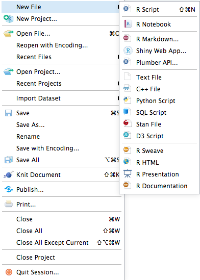
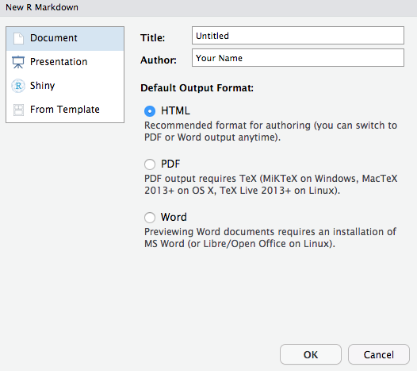
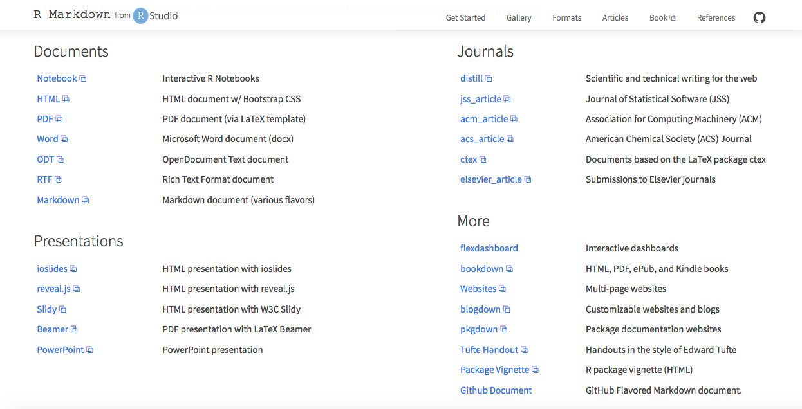
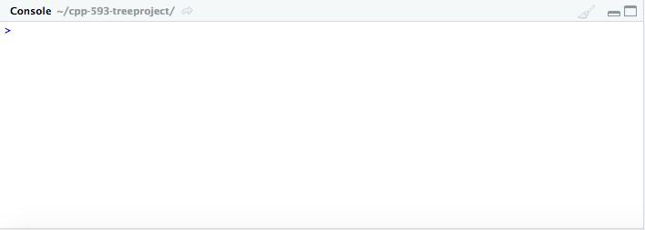
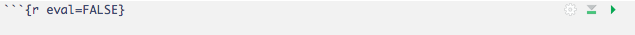



<style type="text/css">
  
#masthead a:link {
  color: #fff;
  background-color: transparent;
  text-decoration: none;
}

</style>

<center> 
  <h1 id = "Introduction">Introduction</h1>
</center>

  <p> As the previous quote by biologist Colin Tudge espouses, trees play an essential role in the daily lives of humans, animals, and plants. Recent research on the widespread benefits of trees in a myriad of areas from environmental to physical to socioeconomic well-being has led policymakers to become advocates for eliminating “concrete jungles” in their cities and expanding tree canopy coverage through the planting of urban forests and other green spaces (“Benefits of trees”, 2019; Endreny, 2018; Kabisch et al., 2017).</p>
  
  <p> Early studies on these initiatives by environmental experts have found that urban forests reduce carbon emissions and mitigate global warming (Johnson et al., 2013; Malmsheimer et al., 2011; McPherson & Simpson, 1999; Russo et al., 2015; Zhao et al., 2010; Zheng et al., 2013). For example, a 2011 study conducted by the U.S. Forest Service iterated that that reducing greenhouse gases in the environment requires the creation of new forests (Malmsheimer et al., 2011), while an earlier study by McPherson & Simpson (1999) specifically focused on providing a guide for conservationists and business/industry executives to increase tree canopy coverage in communities and offset carbon dioxide emissions. Other studies such as those conducted by Johnson et al. (2013) and Russo et al. (2015) suggested urban forests as a way to reduce the effects of transportation on climate change and research by Zhao et al. (2010) and Zheng et al. (2013) provided overarching summaries of the benefits of urban forests. </p>

   <p> Similarly, investigations performed by socioeconomic and public health researchers have simultaneously espoused that trees and urban green spaces have a positive correlation with health and well-being in human living environments (Daams & Veneri, 2016; Dadvand et al., 2014; Dadvand et al., 2018; De Vries et al., 2007; Donovan, 2017; Faber Taylor & Kuo, 2011; King et al., 2015; Reid et al., 2017; Taylor et al., 1998; Turner‐Skoff & Cavender, 2019; U.S. Department of Agriculture, Forest Service, 2018; Ulmer et al., 2016). Studies by Dadvand et al (2014), Dadvand et al. (2018), Faber Taylor & Kuo (2011), Kabisch et al. (2017), Reid et al. (2017), the U.S. Department of Agriculture, Forest Service (2018), and Ulmer et al. (2016) all found that urban green spaces have significant benefits on the physical and mental health and well-being of individuals, particularly those who suffer from chronic illnesses and developmental difficulties such as obesity, asthma, allergies, diabetes, and ADHD. Other research by De Vries et al. (2007) and King et al. (2015) explore urban forests as outlets for safe play in inner-city areas while Turner et al. (2019) highlighted that trees are important for creating sustainable living environments. </p>
  
  <p> Following these scientific findings, cities have begun the task of creating databases to identify where trees are currently located in their communities and identify where new urban forests are needed (Poon, 2018).  However, the financial and human capital required to create these databases, known as tree censuses, are substantial (Poon, 2018).</p>
  
  <p> The city-wide TreesCount! census that was conducted in New York City, required 12,000 volunteer hours from 2,200 citizen mappers who were trained to utilize “high tech mapping tools with survey wheels, tape measures, and tree identification keys” according to a method developed by a non-profit organization, TreeKIT (“TreesCount!”, 2017). This volunteer work saved the city over $100,000 in survey costs, however even with such a large amount of volunteer hours, it took almost a year and a half to complete the census (“TreesCount!”, 2017). Although this was an intuitive way to save money and help “citizen mappers” and “citizen scientists” discover the importance of trees, many organizations do not have access to such a large pool of volunteers and/or are unable to wait years for results (Butt et al., 2013; Poon, 2018, “TreesCount!”, 2017). Therefore, cities and nonprofit groups are in dire need of a secondary assessment method that is quicker, less labor-intensive, and more affordable. </p>
  
  <p> In recent years, remote spatial data analysis tools have emerged as a viable option (Li et al., 2019; Lin et al., 2015; Ren et al., 2015; Tigges & Lakes, 2017). Remote spatial data analysis is a broad field that relies on unmanned aerial vehicles (UAV) and remote sensing (RS) techniques to combine high-quality optical images and LiDAR data into a "fast, replicable, objective, efficient, scalable, and cost-effective way to assess and quantify urban forest dynamics at varying spatiotemporal scales” (Li et al., 2019, p. 2; Lin et al., 2015; Poon, 2018; Tigges & Lakes, 2017). Research conducted by Li et al. (2019) and Poon (2018) explored the importance of improving methods to quantify urban forests while other analyses such as those conducted by Lin et al. (2015), Ren et al. (2015) and Tigges & Lakes (2017), have examined the strengths and limitations of available software. </p>
  
  <p> One area of consensus, though, is that the relatively cost-effective nature of these technologies make them into an important area of future research and an invaluable tool that is particularly attractive to advocates for open-data initiatives (Silva et al, 2018). Subsequently, these researchers have designed several software packages for the open-source data analysis language R (Silva et al., 2018).  It is the goal of this project to examine these software packages and produce a guide that determines the current feasibility of conducting remote tree censuses in an open-source format when the appropriate LiDAR data is available. </p>

<hr>

<br>

<center> 
  <h1 id = "Remote_Tree_Census">Remote Tree Census Tools</h1>
</center>

  <p markdown= "1"> Although the field of remote tree identification is relatively new (the first R package for LiDAR data analysis was developed in [2014](https://www.researchgate.net/publication/324437694_LiDAR_Analysis_in_R_and_rLiDAR_for_Forestry_Applications)), the number of open-source tools available has expanded quickly. In this tutorial, we will be examining the tools available to conduct tree censuses with LiDAR data in R/RStudio. </p>

<center>
  <h2 id = "LIDAR">LiDAR</h2>
</center>

  <h3 markdown= "1"> **What is LiDAR data?** </h3>
  
  <p markdown= "1"> LiDAR is an acronym for _**Light Detection And Ranging**_. </p>
  
  <p markdown= "1"> The National Ocean Service of the [National Oceanic and Atmospheric Administration (NOAA)](https://oceanservice.noaa.gov/facts/lidar.html) describes it as "a remote sensing method that uses light in the form of a pulsed laser to measure ranges (variable distances) to the Earth. These light pulses—combined with other data recorded by the airborne system — generate precise, three-dimensional information about the shape of the Earth and its surface characteristics...[t]opographic lidar typically uses a near-infrared laser to map the land." </p> 
  
  <p markdown= "1"> Further, the NOAA explains the process of collecting LiDAR data in the following way: </p>

  <blockquote markdown= "1">
  When an airborne laser is pointed at a targeted area on the ground, the beam of 
  light is reflected by the surface it encounters. A sensor records this reflected light
  to measure a range. When laser ranges are combined with position and orientation data
  generated from integrated GPS and Inertial Measurement Unit systems, scan angles, and
  calibration data, the result is a dense, detail-rich group of elevation points, called
  a "point cloud."

  Each point in the point cloud has three-dimensional spatial coordinates (latitude,
  longitude, and height) that correspond to a particular point on the Earth's surface
  from which a laser pulse was reflected. The point clouds are used to generate other
  geospatial products, such as digital elevation models, canopy models, building models,
  and contours.
  </blockquote>

  <p markdown= "1"> You can read more on the NOAA website [here](https://oceanservice.noaa.gov/facts/lidar.html). </p>
  
  <p> The following websites provide access to free, publicly available LiDAR data sets: </p>
  
  <p>
  <ul>
  <li> <a href="https://www.geoplatform.gov/">GeoPlatform.gov</a></li> 
  <li> <a href="https://catalog.data.gov/dataset/lidar-point-cloud-usgs-national-map">Data.gov</a> </li>
  <li> <a href="https://www.usgs.gov/faqs/what-lidar-data-and-where-can-i-download-it?qt-news_science_products=0#qt-news_science_products">USGS.gov</a> </li>
  </ul>
  </p>
  
  
<br>

<center> 
  <h2 id = "R_RStudio">R and RStudio</h2> 
</center>

  <h3 markdown= "1">**What is R?**</h3>
  
<center>  
  
</center>

<br>
  
  <p markdown="1"> **R** is an open-source programming environment that was developed for statistical and graphical analysis. The functionality of the environment is easily extended through the installation of software packages that can perform a wide variety of analyses. </p>
  
  <p markdown= "1"> You can read more about R and download the software from the Comprehensive R Archive Network **(CRAN)** for installation on a Linux, Mac OS X, or Windows device by clicking [here](https://www.r-project.org/about.html). </p>
  
  
<br>

  <h3 markdown= "1"> **What is RStudio?** </h3>
  
<center>  

  

</center>

<br>
  
  <p markdown= "1"> **RStudio Desktop** is an open-source software that provides a graphical user interface to run R code and create a variety of document types (such as .html, markdown, .pdf, .docx) that include R code and output. </p>
  
  <p markdown = "1"> You can learn more about the software and install it on your device by clicking [here](https://rstudio.com/index2/). </p>
  
  
<br>

<center>  
  <h1 id= "Code">Code-Through</h1>
</center>

  <p> The following steps will guide you through the process of setting up RStudio and conducting the tree census. </p> 

  <h2 id="SetUp">Set-Up</h2>
  <p> Once you have R and RStudio installed, open RStudio and create a new file of your choice. You may find it easiest to create an RMarkdown file as displayed below: </p>
  
  <center>
  
  </center>
  
  <br>
  
  <p> If you select the RMarkdown option, you will get the following dialog box: </p>
  
  <center>
  
  </center>
  
  <br>
  
  <p markdown="1"> Select the option of your choice for document type. You can change this selection later using any of the multitude of RMarkdown output formats detailed [here](https://rmarkdown.rstudio.com/formats.html). This document was created using the Github document option: </p>
  
  <center>
 
 </center>
  
  
<br>

  <h2 id= "Packages">Packages</h2>
  
  <h3 markdown="1">**Installation**</h3>
  
  <p> Once RStudio is set up, copy and paste the following code into the Console to install the packages that we will need for the tree census: </p>
  
<center>  
  
</center>  

<br>

``` r
# Install Packages

install.packages( "rgdal" )
install.packages( "raster" )
install.packages( "here" )
install.packages( "lidR" )
install.packages( "rLiDAR" )
install.packages( "rgl" )
install.packages( "sp" )
install.packages( "ggmap" )
```

<br>

<p markdown="1"> Another option is to use the insert button to create an R Code chunk that you will copy and paste the code into and run once. After the packages are installed, add `eval=FALSE` to the top of the code chunk. </p>

<center>  
  
</center> 

<br>

<center>

</center>

<br>

 <h3 markdown="1">**Library**</h3>
 
 <p markdown="1"> Once the packages are installed, add them to a code chunk in your RMarkdown file using the `library()` function: </p>
 
 ``` r
# Library
library( "rgdal" )    # Used for LiDAR file processing 
library( "raster" )   # Used for raster tile processing
library( "here" )     # Used to create relative file paths so that code is reproducible
library( "lidR" )     # Used for LiDAR file processing
library( "rLiDAR" )   # Used for LiDAR file processing
library( "sp" )       # Used for mapping and spatial data processing
library( "ggmap" )    # Used for mapping and spatial data processing
```

<br>

<hr>

<center>
  <h1 id = "References">References</h1>
</center>

- Benefits of trees. (2019). <i>Nature Climate Change, 9</i>(8), 569–569. [doi:10.1038/s41558-019-0556-z](https://www.nature.com/articles/s41558-019-0556-z)
    
- Butt, N., Slade, E., Thompson, J., Malhi, Y., & Riutta, T. (2013). Quantifying the sampling error in tree census measurements by volunteers and its effect on carbon stock estimates. <i> Ecological Applications, 23</i>(4), 936–943. [doi:10.1890/11-2059.1](https://esajournals.onlinelibrary.wiley.com/doi/abs/10.1890/11-2059.1)
    
- Daams, M. N. & Veneri, P.  (2016). Living near to attractive nature? A well-being indicator for ranking Dutch, Danish, and German functional urban areas. <i> [Social Indicators Research](https://link.springer.com/article/10.1007/s11205-016-1375-5), 133</i>(2), 501–526.
    
- Dadvand, P., Villanueva, C. M., Font-Ribera, L., Martinez, D., Basagaña, X., Belmonte, J., Vrijheid, M., Gražulevičiene, R., Kogevinas, M., & Nieuwenhuijsen, M. J. (2014). Risks and benefits of green spaces for children: A cross-sectional study of associations with sedentary behavior, obesity, asthma, and allergy. <i>Environmental Health Perspectives, 122</i>(12), 1329–1335. [doi:10.1289/ehp.1308038](https://ehp.niehs.nih.gov/doi/10.1289/ehp.1308038)
    
- Dadvand, P., Poursafa, P., Heshmat, R., Motlagh, M., Qorbani, M., Basagaña, X., & Kelishadi, R. (2018). Use of green spaces and blood glucose in children; a population-based CASPIAN-V study. <i>Environmental Pollution, 243</i>(Pt B), 1134–1140. [https://doi.org/10.1016/j.envpol.2018.09.094](https://doi.org/10.1016/j.envpol.2018.09.094) 
    
- De Vries, S. I., Bakker, I., Van Mechelen, W., & Hopman-Rock, M. (2007). Determinants of activity-friendly neighborhoods for children: Results from the SPACE study. <i>[American Journal of Health Promotion: AJHP](https://journals.sagepub.com/doi/10.4278/0890-1171-21.4s.312), 21</i>(4), 312–316.
    
- Donovan, G. (2017). Including public-health benefits of trees in urban-forestry decision making. <i>Urban Forestry & Urban Greening, 22</i>, 120–123. [https://doi.org/10.1016/j.ufug.2017.02.010](https://doi.org/10.1016/j.ufug.2017.02.010) 
    
- Endreny, T. (2018, April 27). The multi-million-dollar benefits of urban trees. Retrieved May 25, 2020, from [https://www.citylab.com/environment/2018/04/heres-how-much-money-trees-save-in-megacities/559211/](https://www.citylab.com/environment/2018/04/heres-how-much-money-trees-save-in-megacities/559211/)
    
- Faber Taylor, A., & Kuo, F. (2011). Could exposure to everyday green spaces help treat ADHD? Evidence from children’s play settings. <i>Applied Psychology: Health and Well‐Being, 3</i>(3), 281–303. [https://doi.org/10.1111/j.1758-0854.2011.01052.x](https://doi.org/10.1111/j.1758-0854.2011.01052.x) 
      
- Gatziolis, D. & Andersen, H. (2008). A guide to LIDAR data acquisition and processing for the forests of the Pacific Northwest. <i>United States Department of Agriculture Forest Service</i>. Retrieved July 5, 2020, from [https://www.fs.fed.us/pnw/pubs/pnw_gtr768.pdf](https://www.fs.fed.us/pnw/pubs/pnw_gtr768.pdf)

- Johnson, M., Gonzalez, A., Kozak, B., & Sperlak, L. (2013). Carbon estimation and offsets for U.S. university aviation programs. <i>Collegiate Aviation Review, 31</i>(1), 40–56. [https://doi.org/10.22488/okstate.18.100437](https://doi.org/10.22488/okstate.18.100437) 
      
- Kabisch, N., van den Bosch, M., & Lafortezza, R. (2017). The health benefits of nature-based solutions to urbanization challenges for children and the elderly – A systematic review. <i>Environmental Research, 159</i>, 362–373. [doi:10.1016/j.envres.2017.08.004](https://www.sciencedirect.com/science/article/abs/pii/S0013935117315396?via%3Dihub)
      
 - King, D. K., Litt, J., Hale, J., Burniece, K. M., & Ross, C. (2015). “The park a tree built”: Evaluating how a park development project impacted where people play. <i>Urban Forestry & Urban Greening, 14</i>(2), 293–299. [doi:10.1016/j.ufug.2015.02.011](https://www.sciencedirect.com/science/article/abs/pii/S1618866715000291?via%3Dihub) 
      
 - Li, X., Chen, W. Y., Sanesi, G., & Lafortezza, R. (2019). Remote sensing in urban forestry: Recent applications and future directions. <i>Remote Sensing, 11</i>(10) [doi:10.3390/rs11101144](https://www.mdpi.com/2072-4292/11/10/1144)
      
 - Lin, Y., Jiang, M., Yao, Y., Zhang, L., & Lin, J. (2015). Use of UAV oblique imaging for the detection of individual trees in residential environments. <i>Urban Forestry & Urban Greening, 14</i>(2), 404–412. [doi:10.1016/j.ufug.2015.03.003](https://www.sciencedirect.com/science/article/abs/pii/S1618866715000333?via%3Dihub)
      
 - Malmsheimer, R. W., Bowyer, J. L., Fried, J. S., Gee, E., Izlar, R., Miner, R. A., Munn, I. A., Oneil, E., & Stewart, W. C. (2011). Managing forests because carbon matters: Integrating energy, products, and land management policy. <i>Journal of Forestry, 109</i>(7), S7-S50. Retrieved May 31, 2020, from [https://www.fs.usda.gov/treesearch/pubs/40291](https://www.fs.usda.gov/treesearch/pubs/40291)

- McPherson, E., & Simpson, J. (1999). Carbon dioxide reduction through urban forestry: guidelines for professional and volunteer tree planters. Albany, Calif: U.S. Dept. of Agriculture, Forest Service, Pacific Southwest Research Station. Retrieved May 31, 2020, from [https://permanent.access.gpo.gov/lps94433/psw-gtr171.pdf](https://permanent.access.gpo.gov/lps94433/psw-gtr171.pdf)

- National Oceanic and Atmospheric Administration (NOAA) (2020, July 1). What is lidar?. <i>National Ocean Service website.</i> Retrieved July 3, 2020, from [https://oceanservice.noaa.gov/facts/lidar.html](https://oceanservice.noaa.gov/facts/lidar.html)
   
- Poon, L. (2018, December 28). Every tree in the city, mapped. Retrieved May 25, 2020, from [https://www.citylab.com/environment/2018/12/urban-tree-canopy-maps-artificial-intelligence-descartes-labs/578701/](https://www.citylab.com/environment/2018/12/urban-tree-canopy-maps-artificial-intelligence-descartes-labs/578701/)

- RStudio. (n.d.). RStudio Logo. Retrieved July 4, 2020, from [https://rstudio.com/about/logos/](https://rstudio.com/about/logos/)

- Reid, C., Clougherty, J., Shmool, J., & Kubzansky, L. (2017). Is all urban green space the same? A comparison of the health benefits of trees and grass in New York City. <i>International Journal of Environmental Research and Public Health, 14</i>(11), 1411. [doi:10.3390/ijerph14111411](https://www.mdpi.com/1660-4601/14/11/1411)

- Ren, Z., Zheng, H., He, X., Zhang, D., Yu, X., & Shen, G. (2015). Spatial estimation of urban forest structures with Landsat TM data and field measurements. <i>Urban Forestry & Urban Greening, 14</i>(2), 336–344. [doi:10.1016/j.ufug.2015.03.008](https://www.sciencedirect.com/science/article/abs/pii/S1618866715000400?via%3Dihub)

- Russo, A., Escobedo, F. J., Timilsina, N., & Zerbe, S. (2015). Transportation carbon dioxide emission offsets by public urban trees: A case study in Bolzano, Italy. <i>Urban Forestry & Urban Greening, 14</i>(2), 398–403. [doi:10.1016/j.ufug.2015.04.002](https://linkinghub.elsevier.com/retrieve/pii/S1618866715000424)

- Silva, C. A., Klauberg, C. M., Mohan, M. M., & Bright, B. C. (2018). LiDAR Analysis in R and rLiDAR for Forestry Applications. Retrieved from [https://www.researchgate.net/publication/324437694_LiDAR_Analysis_in_R_and_rLiDAR_for_Forestry_Applications](https://www.researchgate.net/publication/324437694_LiDAR_Analysis_in_R_and_rLiDAR_for_Forestry_Applications)

- Taylor, A. F., Wiley, A., Kuo, F. E., & Sullivan, W. C. (1998). Growing up in the inner city: Green spaces as places to grow. <i>Environment and Behavior, 30</i>(1), 3–27. [https://doi.org/10.1177/0013916598301001](https://doi.org/10.1177/0013916598301001)

- The R Foundation. (2016). The R logo. Retrieved July 4, 2020, from [https://www.r-project.org/logo/](https://www.r-project.org/logo/)

- Thomson, C. (2020). How to overcome large datasets in point cloud processing. <i>Vercator</i>. Retrieved July 5, 2020, from [https://info.vercator.com/blog/how-to-overcome-large-datasets-in-point-cloud-processing](https://info.vercator.com/blog/how-to-overcome-large-datasets-in-point-cloud-processing)

- Tigges, J., & Lakes, T. (2017). High resolution remote sensing for reducing uncertainties in urban forest carbon offset life cycle assessments. <i>Carbon Balance and Management, 12</i>(1), 1–18. [https://doi.org/10.1186/s13021-017-0085-x](https://doi.org/10.1186/s13021-017-0085-x)

- TreesCount! (2017). Retrieved May 31, 2020, from [http://media.nycgovparks.org/images/web/TreesCount/Index.html](http://media.nycgovparks.org/images/web/TreesCount/Index.html)

- Turner‐Skoff, J. B., & Cavender, N. (2019). The benefits of trees for livable and sustainable communities. <i>Plants, People, Planet, 1</i>(4), 323–335. [doi:10.1002/ppp3.39](https://nph.onlinelibrary.wiley.com/doi/full/10.1002/ppp3.39)

- U.S. Department of Agriculture, Forest Service. (2018). Urban nature for human health and well-being: A research summary for communicating the health benefits of urban trees and green space. FS-1096. Washington, DC. Retrieved May 25, 2020, from [https://permanent.access.gpo.gov/gpo91156/urbannatureforhumanhealthandwellbeing_508_01_30_18.pdf](https://permanent.access.gpo.gov/gpo91156/urbannatureforhumanhealthandwellbeing_508_01_30_18.pdf)

- USGS. (2014). NGA LiDAR project - Phoenix, AZ. Retrieved July 4, 2020, from ASU Library Map and Geospatial Hub [https://lib.asu.edu/geo](https://lib.asu.edu/geo)

- Ulmer, J. M., Wolf, K. L., Backman, D. R., Tretheway, R. L., Blain, C. J., O’Neil-Dunne, J. P., & Frank, L. D. (2016). Multiple health benefits of urban tree canopy: The mounting evidence for a green prescription. <i>Health & Place, 42</i>, 54–62. [doi:10.1016/j.healthplace.2016.08.011](https://linkinghub.elsevier.com/retrieve/pii/S1353829216301332)

- Zhao, M., Kong, Z.-H., Escobedo, F. J., & Gao, J. (2010). Impacts of urban forests on offsetting carbon emissions from industrial energy use in Hangzhou, China. <i>Journal of Environmental Management, 91</i>(4), 807–813. [doi:10.1016/j.jenvman.2009.10.010](https://www.sciencedirect.com/science/article/pii/S030147970900365X?via%3Dihub)
  
- Zheng, D., Ducey, M., & Heath, L. (2013). Assessing net carbon sequestration on urban and community forests of northern New England, USA. <i>Urban Forestry & Urban Greening, 12</i>(1), 61–68. [https://doi.org/10.1016/j.ufug.2012.10.003](https://doi.org/10.1016/j.ufug.2012.10.003)

<br>

---

<center>
  <h1 id = "Author">Author</h1>
</center>
  <p> Courtney Stowers </p>
  
---

